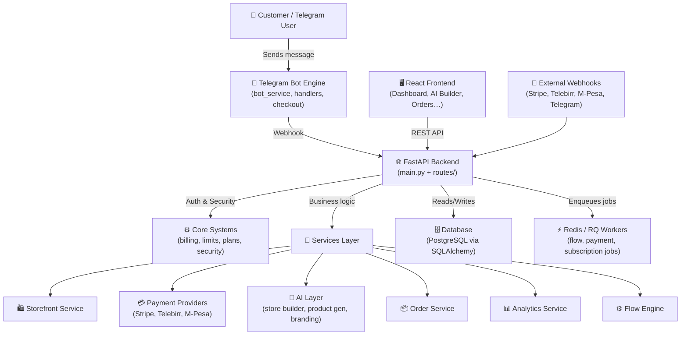
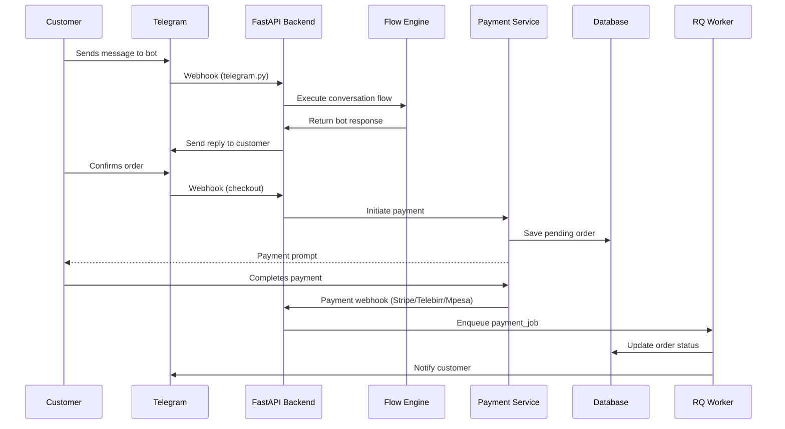
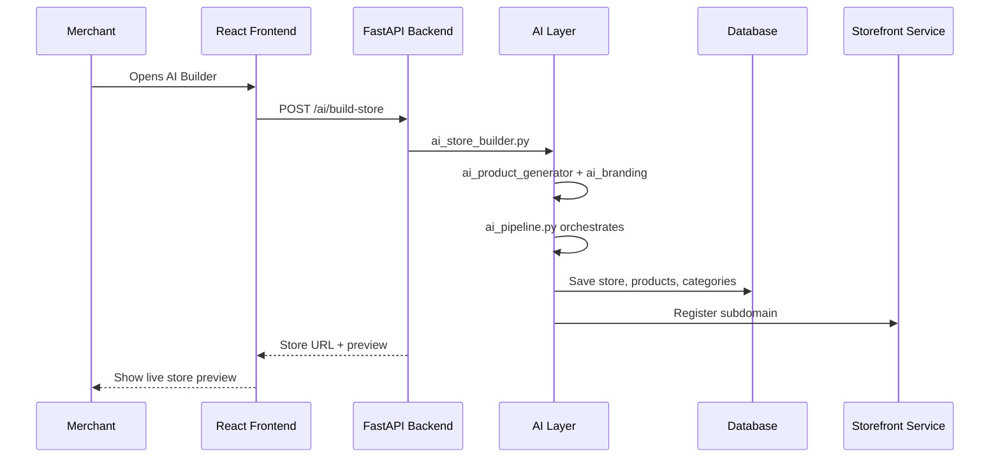
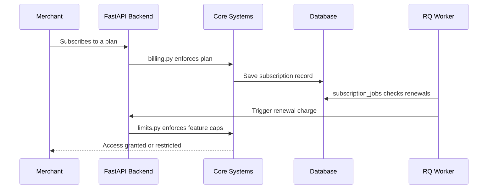

# SaaS Bot Architecture (1)

This page documents the full architecture of the Telegram SaaS Platform — how the codebase is structured, what each layer does, and how everything connects.

---

## 🗺️ High-Level Architecture Overview

The platform is a multi-tenant Telegram SaaS that lets businesses run full e-commerce stores inside Telegram bots. Here's how the major layers interact:

### Layer Summary

| Layer | What it does | Key files |
| --- | --- | --- |
| **Telegram Engine** | Handles all bot interactions — messages, checkout UI, session state | `services/telegram/` |
| **FastAPI Backend** | REST API, webhook receivers, routing | `app/main.py`, `routes/` |
| **Core Systems** | Subscription enforcement, plan limits, JWT auth | `core/` |
| **AI Layer** | AI-powered store creation, product generation, branding | `services/ai/` |
| **Flow Engine** | Custom bot conversation flows defined by merchants | `flow_engine.py`, `flow_executor.py` |
| **Payments** | Multi-provider payments (Stripe, Telebirr, M-Pesa) | `services/payments/` |
| **Background Jobs** | Async processing for flows, payments, subscription renewals | `workers/` |
| **Frontend** | React merchant dashboard for managing store, products, orders | `apps/frontend/` |

---

## 🔄 Data Flow

This section describes how data moves through the system for the three core scenarios.

### 1. Customer Places an Order via Telegram

### 2. Merchant Builds a Store with AI

### 3. Subscription Lifecycle

---

## 🔌 Entry + Core

`apps/backend/app/`

- `main.py` — Application entry point
- `config.py` — Centralized env settings
- `database.py` — Database connection setup

---

## ⚙️ Core Systems

`core/`

- `queue.py` — Redis/RQ job queue
- `billing.py` — Subscription enforcement
- `limits.py` — Plan limits
- `plans.py` — Pricing tiers
- `security.py` — Auth utils (JWT, hashing)

---

## 🧱 Domain Models

`models/`

- `business.py`
- `store.py` — Storefront + subdomain
- `category.py`
- `product.py`
- `order.py`
- `session.py` — Telegram session state
- `flow.py`
- `payment.py`
- `subscription.py`

---

## 🌐 API Routes

`routes/`

- `auth.py`
- `products.py`
- `stores.py` — Subdomain + storefront
- `flows.py`
- `payments.py`
- `billing.py`
- `ai.py` — AI store + product builder
- `analytics.py`

**Webhooks** (`routes/webhooks/`)

- `telegram.py`
- `stripe.py`
- `telebirr.py`
- `mpesa.py`

---

## 🧠 Business Logic

`services/`

### AI Layer (`services/ai/`)

- `ai_storefront.py`
- `ai_store_builder.py`
- `ai_product_generator.py`
- `ai_branding.py`
- `ai_categories.py`
- `ai_homepage.py`
- `ai_pipeline.py`

### 🤖 Telegram Engine (`services/telegram/`)

- `bot_service.py`
- `handlers.py`
- `checkout.py`
- `ui_components.py`

### ⚙️ Flow Engine

- `flow_engine.py`
- `flow_executor.py`

### 💳 Payments (`services/payments/`)

- `payment_factory.py`
- `stripe_provider.py`
- `telebirr_provider.py`
- `mpesa_provider.py`

### 🌐 Storefront

- `storefront_service.py`
- `domain_service.py`

### 📊 Analytics

- `analytics_service.py`

### 📦 Orders

- `order_service.py`

---

## ⚡ Background Jobs

`workers/`

- `tasks.py`
- `flow_jobs.py`
- `payment_jobs.py`
- `subscription_jobs.py`

---

## 🖥️ Frontend

`apps/frontend/src/`

**Pages**

- `Dashboard.jsx`
- `AIBuilder.jsx`
- `Products.jsx`
- `Orders.jsx`
- `Analytics.jsx`
- `Pricing.jsx`
- `StorePreview.jsx`

**Components**

- `Layout.jsx`
- `Sidebar.jsx`
- `Navbar.jsx`
- `ProductCard.jsx`
- `Loader.jsx`

**Services**

- `api.js`
- `auth.js`

**Utils**

- `getSubdomain.js`
- `formatCurrency.js`

---

## 🏗️ Infrastructure

- `infra/docker-compose.yml` — Local dev environment
- `render.yaml` — Render deployment config
- `.env.example` — Environment variable template
- `README.md` — Project documentation
- `apps/backend/alembic/` — DB migrations
- `apps/backend/requirements.txt`
- `apps/worker/worker.py` — Standalone worker process